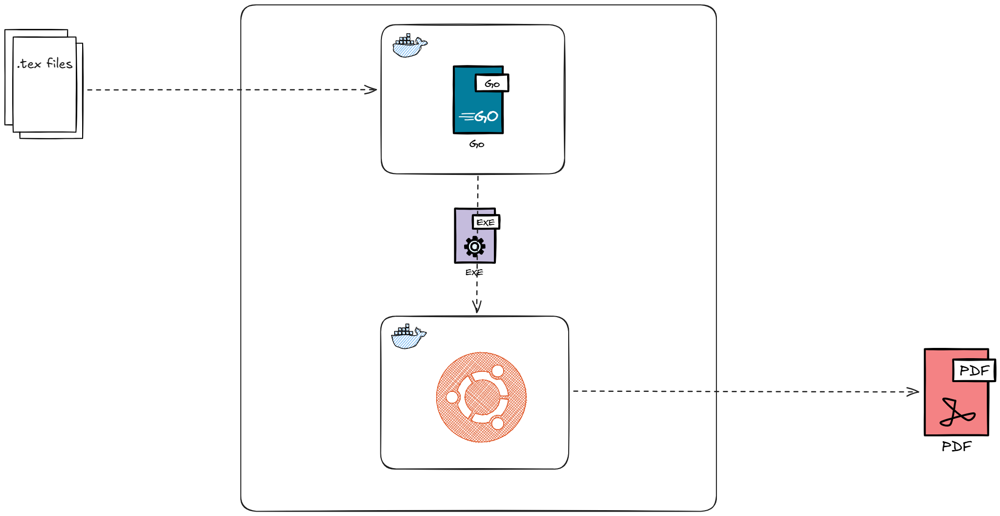

# LaTeX Compiler Service

A robust, containerized microservice written in Go that compiles LaTeX projects into PDF documents. It is designed to handle complex, multi-file LaTeX projects and includes intelligent error handling for missing assets.

## Features

*   **Containerized Environment**: Runs on a lightweight Alpine-based Go builder and a feature-rich Ubuntu runtime with the full TeX Live distribution.
*   **Multi-File Support**: Accepts multiple files (chapters, styles, images) in a single request.
*   **Resilient Compilation**: Automatically detects missing image files during compilation and generates transparent placeholders to ensure the PDF builds successfully even with missing assets.
*   **REST API**: Simple HTTP interface for easy integration.
*   **Automatic Cleanup**: Creates isolated workspaces for each request and cleans them up automatically.

## Workflow



## Getting Started

### Prerequisites

*   Docker

### Build the Image

```bash
docker build -t latex-go .
```

### Run the Container

```bash
docker run -p 8000:8000 latex-go
```

## API Usage

### Compile PDF

**Endpoint:** `POST /compile`

**Body:** `multipart/form-data`

*   `files`: The list of files to compile. **Must include a file named `main.tex`**.
